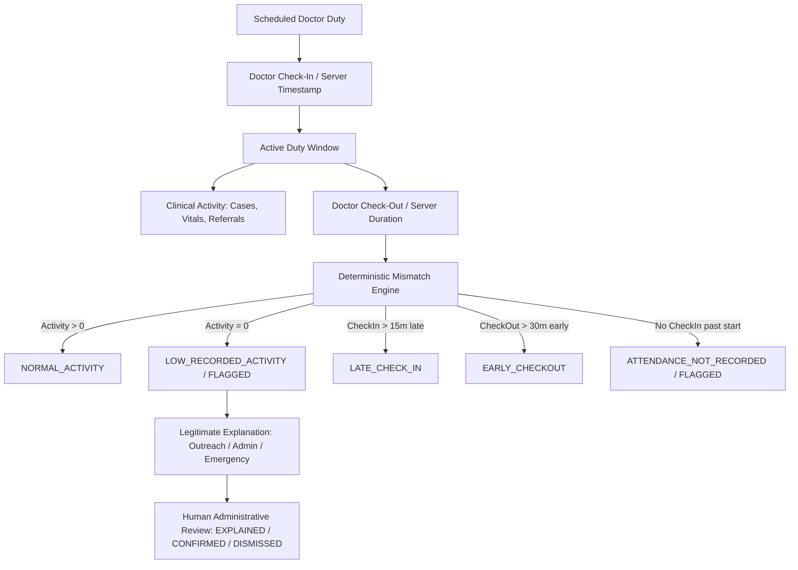
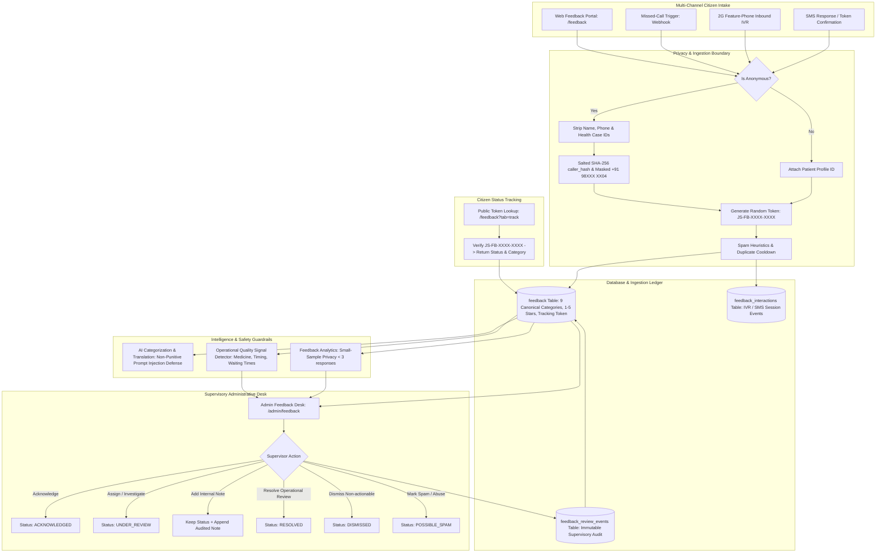
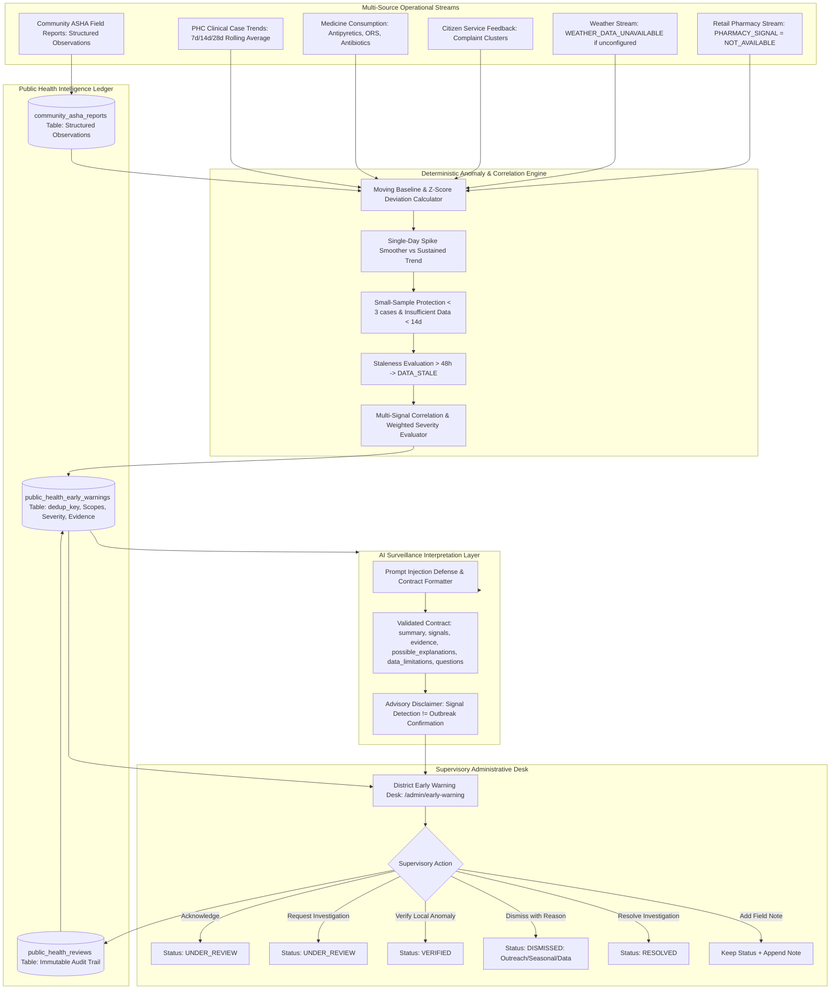
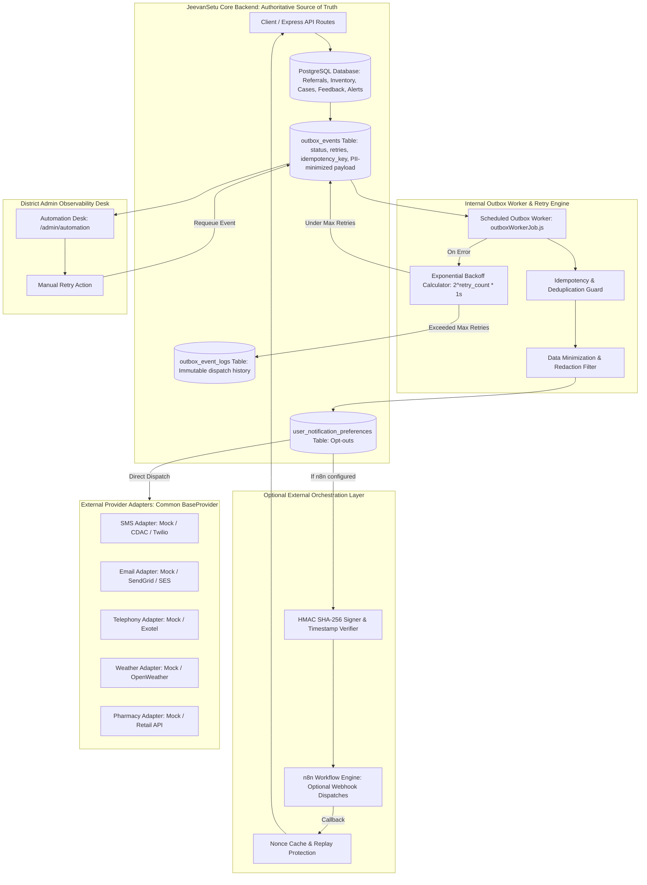
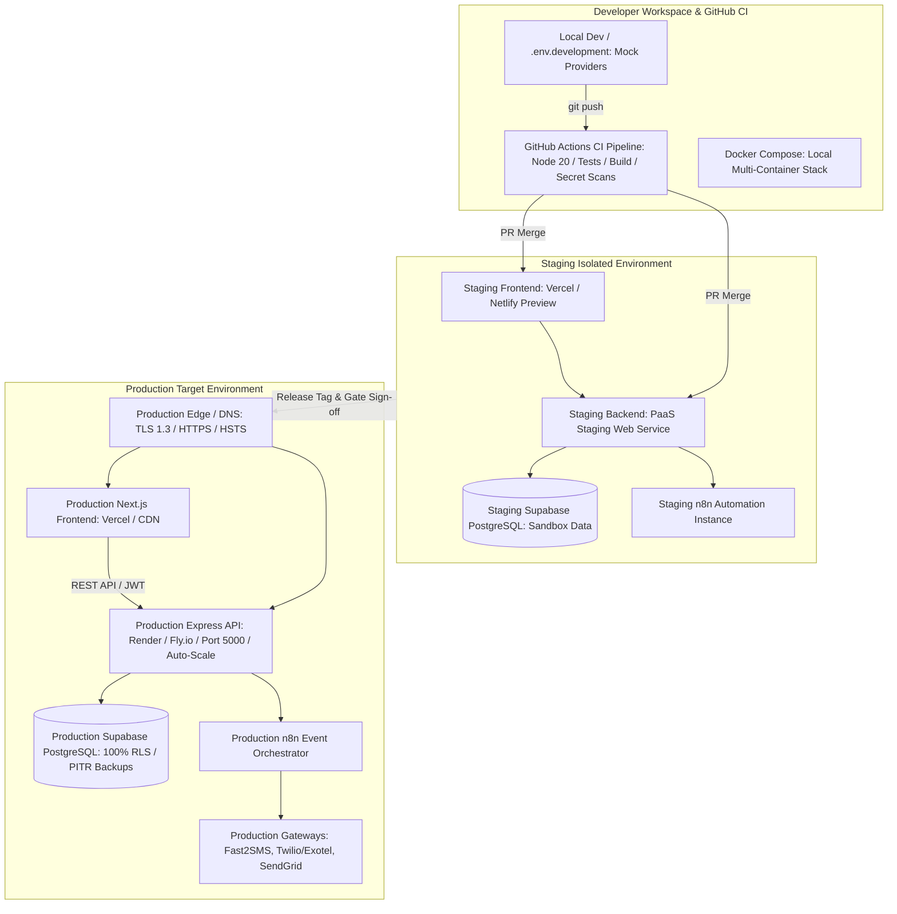
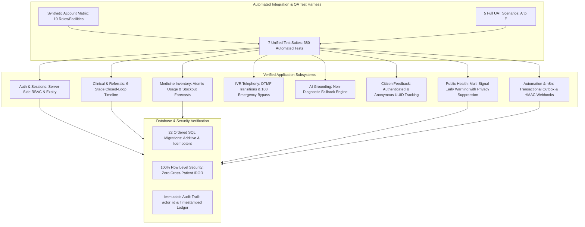
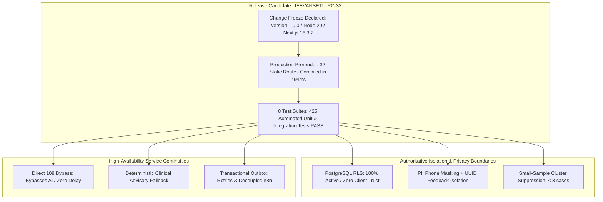
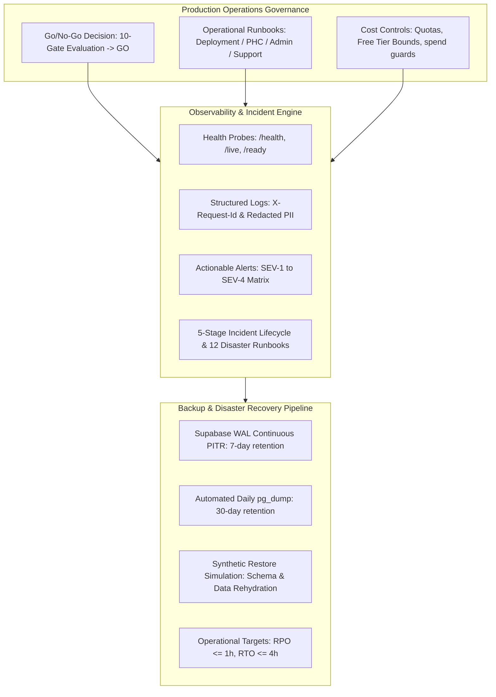

# JeevanSetu Architecture: Phase 21 Doctor Presence & Attendance Integrity



# Phase 22: Referral Follow-Up & Treatment Completion Lifecycle

```mermaid
flowchart TD
    Created[PHC Referral Created] --> Accepted[Hospital Accepted]
    Accepted --> Transport[Transport Arranged: NGO/Ambulance/Family/Self]
    Transport --> Departed[Patient Departed]
    Departed --> ArrivalAck[Patient Reports Arrival]
    Departed --> HospConfirm[Hospital Confirms Arrival]
    ArrivalAck --> ConfPending[HOSPITAL_CONFIRMATION_PENDING]
    HospConfirm --> TrtStart[Treatment Started]
    TrtStart --> TrtDone[Treatment Completed]
    TrtDone -->|Follow-up needed| FollowUpReq[Follow-Up Required / Due Date]
    TrtDone -->|No follow-up| ClosedLoop[COMPLETED / CLOSED]
    FollowUpReq --> FollowUpDone[PHC Follow-Up Completed]
    FollowUpReq -->|Past due date| Overdue[OVERDUE / REQUIRES_ATTENTION]
    FollowUpDone --> ClosedLoop
# Phase 25: Doctor Presence & PHC Operational Accountability Architecture

```mermaid
flowchart TD
    Schedule[Scheduled Duty: doctor_duty_schedules] --> CheckIn[Doctor Check-In / Authoritative Server Timestamp]
    CheckIn --> ActiveSession[Active Presence Session: doctor_presence_sessions]
    ActiveSession --> ClinicalEncounters[Clinical Encounters: health_cases Linkage & Dedup]
    ActiveSession --> CheckOut[Doctor Check-Out / Duration Calculation]
    CheckOut --> CompletedSession[Session Completed / CHECKED_OUT]
    ActiveSession --> AnomalyEngine[Deterministic Operational Consistency Engine]
    CompletedSession --> AnomalyEngine
    AnomalyEngine -->|Elapsed >= 120m & Encounters = 0| ZeroEncFlag[NO_ENCOUNTERS_DURING_DUTY: MEDIUM Severity]
    AnomalyEngine -->|Check-in without schedule| UnscheduledFlag[CHECKIN_WITHOUT_SCHEDULE: INFO Severity]
    AnomalyEngine -->|Duration < 5 min| RapidCheckoutFlag[UNUSUAL_SESSION_DURATION: LOW Severity]
    AnomalyEngine -->|Missing checkout > 12h| MissingCheckoutFlag[MISSING_CHECKOUT: LOW Severity]
    AnomalyEngine -->|Offline / Stale Sync| StaleSyncNotice[DATA_STALE: Neutral Operational Banner]
    ZeroEncFlag --> ReviewFlags[(doctor_operational_flags: OPEN / UNDER_REVIEW / RESOLVED / DISMISSED)]
    UnscheduledFlag --> ReviewFlags
    RapidCheckoutFlag --> ReviewFlags
    MissingCheckoutFlag --> ReviewFlags
    ReviewFlags --> HumanReview[Human-in-the-Loop Supervisory Review: PHC Staff / District Admin]
    HumanReview --> LegitimateCategory{Legitimate Operational Reason?}
    LegitimateCategory -->|Outreach Camp / School Checkup| DismissOutreach[DISMISSED: OUTREACH]
    LegitimateCategory -->|Administrative Duty / Report| DismissAdmin[DISMISSED: ADMIN_DUTY]
    LegitimateCategory -->|Training / Workshop| DismissTraining[DISMISSED: TRAINING]
    LegitimateCategory -->|Emergency Deployment| DismissEmergency[DISMISSED: EMERGENCY_DEPLOYMENT]
    LegitimateCategory -->|PHC Temporary Closure / Power| DismissClosure[DISMISSED: PHC_CLOSED]
    HumanReview --> AuditLedger[(doctor_operational_reviews: Immutable Audit Ledger)]
    ReviewFlags --> GroundedAI[Safe Advisory AI Explainer: summarizeDoctorPresenceFlag]
```

# Phase 23: Medicine Inventory & Demand Forecasting Pipeline

```mermaid
flowchart TD
    Receipt[Stock Receipt / Restock] --> Inv[(medicine_inventory)]
    Dispensation[OPD Dispensation] --> Usage[(medicine_usage)]
    Usage --> Inv
    Usage --> MultiWindow[Multi-Window Usage Engine: 7d, 14d, 30d, 90d]
    MultiWindow --> Sufficiency{Data Sufficiency >= 3 Days?}
    Sufficiency -->|No| InsuffState[INSUFFICIENT_DATA: Stockout Date = null]
    Sufficiency -->|Yes| ForecastCalc[Deterministic Depletion Engine: Burn Rate & Coverage]
    ForecastCalc --> TrendClass[Trend: STABLE / INCREASING / DECREASING / VOLATILE]
    ForecastCalc --> RiskClass[Risk Level: NORMAL / LOW / MEDIUM / HIGH / CRITICAL / OUT_OF_STOCK]
    RiskClass --> AlertFilter{Risk >= HIGH or Reorder Due?}
    AlertFilter -->|Yes| AlertDedup[Deduplicated Inventory Alerts]
    AlertDedup --> StaffNotify[PHC Staff & District Supply Notifications]
    ForecastCalc --> Persist[(medicine_forecasts: model_version, MAE, MAPE)]
    Persist --> AISummary[AI Advisory Explanation & Forecast Interpretation]
# Phase 24: IVR & Feature-Phone Health Access Architecture

```mermaid
flowchart TD
    PSTN[2G Feature Phone / Landline] --> Gateway[Telephony Gateway / Webhook]
    Gateway --> Security[Security Layer: HMAC Signature, Replay Drift & Nonce Check, Rate Limiter]
    Security --> Provider[Telephony Provider Abstraction: MockProvider / ProductionAdapter]
    Provider --> SessionEngine[IVR Session Manager: 10m TTL, Phone Masking +91 98XXX XX04]
    SessionEngine --> FlowEngine[Deterministic State Machine & Multilingual Audio Dictionary]
    Language --> MainMenu{Main Menu Selection}
    MainMenu -->|1| Guidance[1: Health Guidance / Triage]
    MainMenu -->|2| RefStatus[2: Referral Status: 4-Digit PIN Auth]
    MainMenu -->|3| Facilities[3: Facility Information: PHC / Hospital]
    MainMenu -->|4| Medicines[4: Essential Medicine Stock & Freshness]
    MainMenu -->|5| Callback[5: ASHA / PHC Callback Request]
    MainMenu -->|6| Schemes[6: Government Schemes: PM-JAY, MJPJAY, JSY]
    MainMenu -->|0| Exit[0: Hangup & Friendly Farewell Audio]
    Guidance -->|Option 4: Red Flag Symptom| Emerg108[⚠️ Immediate 108 Ambulance Dispatch Alert & Hangup]
    Callback --> CallbackQueue[(ivr_followup_requests: Deduplication & Staff Desk)]
    FlowEngine --> AIValidation[AI Contract Formatter: formatSafeIVRPrompt & Strict Non-Diagnostic Validation]
    AIValidation -->|Invalid Output or Unsafe Attempt| DeterministicFallback[Deterministic Local Dictionary Fallback]
```

# Phase 26: Citizen Feedback & Missed-Call Architecture



# Phase 27: Public Health Early Warning & Outbreak Intelligence Architecture



---

## 15. Automation, Outbox Pattern & n8n Orchestration Architecture (Phase 28)



---

## 16. Observability, Monitoring, Reliability & Probes Architecture (Phase 29)

```mermaid
flowchart TD
    subgraph ClientAndEdge[Client Layer & Edge Requests]
        NextApp[Next.js Frontend: ErrorBoundary & Global Fallback]
        IncomingReq[Incoming API Call / Trace]
    end

    subgraph TracingAndLogging[Request Tracing & Structured Logging]
        ReqIdMiddleware[Request ID Middleware: generates or preserves x-request-id]
        LoggerMiddleware[Structured Request Logger: duration, status, route, role]
        RedactionEngine[PII & Secret Redaction Engine: masks phone, strips keys]
    end

    subgraph ErrorAndTelemetry[Error Classification & Telemetry Engine]
        CentralErrorHandler[Centralized Error Handler: classifies error code, status, req_id]
        MetricsService[Observability Metrics Service: traffic, latency, p95, error rate]
        JobMonitorService[Background Job Monitor & Stuck Detector: 5m runtime threshold]
        SecurityMonitor[Security Event Monitor: auth failures, replay attacks]
        AlertDeduplicator[Alert Deduplication Engine: fingerprint & cooldown]
    end

    subgraph HealthAndProbes[Health & Dependency Probes]
        LivenessProbe[/api/health/live: process alive, uptime]
        ReadinessProbe[/api/health/ready: database latency, job state, degraded features]
        UnifiedHealth[/api/health: operational snapshot]
    end

    subgraph OperationsDesk[Admin Operations Desk: /admin/operations]
        HealthTiles[Probes & Dependency Health Grid]
        MetricsGrid[Traffic, Latency, Error Rate %]
        JobsTable[Background Job Execution Table]
        SanitizedErrors[Recent Sanitized Error Ledger]
        SecurityLog[Operational Security Event Stream]
    end

    IncomingReq --> ReqIdMiddleware
    ReqIdMiddleware --> LoggerMiddleware
    LoggerMiddleware --> RedactionEngine
    
    LoggerMiddleware --> MetricsService
    CentralErrorHandler --> RedactionEngine
    CentralErrorHandler --> MetricsService
    
    JobMonitorService --> MetricsService
    JobMonitorService --> AlertDeduplicator
    SecurityMonitor --> MetricsService
    
    MetricsService --> ReadinessProbe
    MetricsService --> UnifiedHealth
    
    MetricsService --> OperationsDesk
    JobMonitorService --> JobsTable
    RedactionEngine --> SanitizedErrors
    SecurityMonitor --> SecurityLog
```

---

## 17. Production Security Hardening, Privacy & RLS Architecture (Phase 30)

```mermaid
flowchart TD
    subgraph ClientLayer[Edge & Client Boundary]
        BrowserClient[Browser / Next.js Client: Public Anon Keys Only]
        TelephonyWebhook[Telephony / n8n Webhook Gateway]
    end

    subgraph DefenseInDepth[Defense in Depth API Middleware Layer]
        HelmetHeaders[Helmet Security Headers: CSP, Frameguard Deny, Nosniff]
        CORSGuard[Strict CORS Policy: Production Domain Whitelisting]
        RateLimiter[Sliding Window Rate Limiters: Auth 30/15m, AI 20/m, Global 300/m]
        SizeGuard[Body Parser Limit: 10kb Max Payload Size]
        AuthGuard[Supabase Auth Guard: Server-Side JWT Verification]
        RBACMiddleware[Role-Based Access Control: 6 Authoritative Roles]
        IDORChecker[IDOR Scope Validator: Facility & Patient Scoping]
        WebhookVerifier[HMAC SHA-256 Signature & Nonce Replay Verifier]
    end

    subgraph ServiceAndDataLayer[Service Layer & Database RLS Authority]
        WhitelistingService[Service Mutation Whitelisting: allowedKeys Mass-Assignment Protection]
        SupabaseClient[Supabase Server Client]
        PostgresRLS[(PostgreSQL Database: 100% RLS on Sensitive Tables)]
        ImmutableAuditLogs[(audit_logs Table: Append-Only Immutable Ledger)]
    end

    subgraph PrivacyRedaction[Privacy & Data Minimization Subsystem]
        PIIMasking[Phone Number Masking: +91 98XXX XX04]
        SecretStripper[Secret & Token Redactor: [REDACTED]]
        AnonFeedbackIsolation[Anonymous Tracking Isolation: UUID token, no patient link]
    end

    BrowserClient --> HelmetHeaders
    TelephonyWebhook --> HelmetHeaders
    HelmetHeaders --> CORSGuard
    CORSGuard --> RateLimiter
    RateLimiter --> SizeGuard
    
    SizeGuard --> AuthGuard
    SizeGuard --> WebhookVerifier
    
    AuthGuard --> RBACMiddleware
    RBACMiddleware --> IDORChecker
    IDORChecker --> WhitelistingService
    
    WhitelistingService --> SupabaseClient
    SupabaseClient --> PostgresRLS
    PostgresRLS --> ImmutableAuditLogs
    
    WhitelistingService --> PrivacyRedaction
    PrivacyRedaction --> ImmutableAuditLogs
```

---

## 18. Production Deployment, CI/CD & Infrastructure Topology (Phase 31)



---

## 19. Master End-to-End QA & Integration Architecture (Phase 32)



---

## 20. Release Candidate Topology & Change Freeze Architecture (Phase 33)



---

## 21. Production Operations & Incident Management Architecture (Phase 34)



---

## 22. Final Production Launch Topology & Rehearsal Architecture (Phase 35)

```mermaid
flowchart TD
    subgraph LaunchRehearsalState[Pre-Launch Verification Harness]
        RCIdentity[Release Candidate: JEEVANSETU-RC-33 / Version 1.0.0]
        AllSuites[10 Automated Test Suites: 471 Unit & Integration Tests PASS]
        PrerenderBuild[Next.js Production Build: 32 Static Routes Compiled in 515ms]
    end

    subgraph SixRoleWorkflows[6 Rehearsed Primary User Journeys]
        FlowA[Flow A: Patient Care & Feedback]
        FlowB[Flow B: PHC Triage & Inventory]
        FlowC[Flow C: Doctor Clinical Review]
        FlowD[Flow D: Hospital Referral Intake]
        FlowE[Flow E: NGO Transport Coordination]
        FlowF[Flow F: District Admin Operations]
    end

    subgraph ProductionReadinessSignoff[Final Launch Decision & Execution]
        GoMatrix[10-Gate Quality Matrix: 10 / 10 PASS]
        FinalGo[Official Decision: GO FOR LAUNCH]
        DeployRunbook[Execution Runbook: docs/production-runbook.md]
    end

    RCIdentity --> SixRoleWorkflows
    AllSuites --> SixRoleWorkflows
    PrerenderBuild --> SixRoleWorkflows

    SixRoleWorkflows --> GoMatrix
    GoMatrix --> FinalGo
---

## 23. Grounded Healthcare AI & Browser Voice Architecture

```mermaid
flowchart TD
    subgraph ClientLayer[Frontend Access Layer]
        TextUI[Chatbot UI: /assistant]
        VoiceUI[Browser Voice Assistant & Floating Widget]
        STTEngine[Speech-to-Text: BrowserSpeechRecognitionProvider]
        TTSEngine[Text-to-Speech: BrowserTTSProvider]
    end

    subgraph SecurityAndRouting[Backend Ingress & Security]
        OptAuth[optionalAuth Middleware: JWT / Public Guest Context]
        RateLimit[In-Memory Rate Limiter: 20 req/min]
        SafetyService[safety.service.js: Emergency & Injection Interceptor]
    end

    subgraph DataGrounding[Permissioned Context Retrieval]
        ContextEngine[context.service.js: Scoped Resource Grounding]
        DB[(Supabase PostgreSQL: Schemes, Hospitals, Inventory, Referrals)]
        PIIMask[PII Minimization: Phone Masking + Credential Redaction]
    end

    subgraph AIProviders[Unified AI Inference Layer]
        Gemini[GeminiProvider: gemini-1.5-flash]
        Claude[ClaudeProvider: claude-3-5-sonnet]
        Fallback[FallbackAIProvider: Multilingual Deterministic Engine]
    end

    TextUI --> OptAuth
    VoiceUI --> STTEngine
    STTEngine --> OptAuth
    OptAuth --> RateLimit
    RateLimit --> SafetyService
    SafetyService -->|Red-Flag Emergency| 108Escalation[108 Ambulance Dispatch Response]
    SafetyService -->|Prescription Attempt| PresRefusal[Non-Diagnostic Refusal Notice]
    SafetyService -->|Injection Attempt| InjRefusal[Safety Policy Refusal Notice]
    SafetyService -->|Safe Healthcare Query| ContextEngine
    ContextEngine --> DB
    DB --> PIIMask
    PIIMask --> AIProviders
    AIProviders --> ResponseEnvelope[Standardized Safe JSON Response]
    ResponseEnvelope --> TextUI
    ResponseEnvelope --> TTSEngine
    TTSEngine --> VoiceUI
# Global Theme Architecture (Light Default & Persistent Dark Mode)

```mermaid
flowchart TD
    subgraph Storage[Client State & Persistence]
        LocalStorage[localStorage: 'jeevansetu_theme' -> 'light' | 'dark']
        DefaultLight[Strict Default: 'light' if null/invalid]
    end

    subgraph PrePaint[SSR Pre-Paint Fast Execution]
        HeadScript[layout.js inline <head> script]
        HTMLTag[<html class='dark' data-theme='dark'> or <html class='light' data-theme='light'>]
    end

    subgraph ThemeProviderLayer[React Theme Context]
        ThemeContext[frontend/context/ThemeContext.js]
        NavbarToggle[Navbar / Topbar ThemeToggle Component]
        SettingsCards[Settings Page Theme Selection Cards]
    end

    subgraph StyleEngine[Tailwind CSS v4 Token System]
        TailwindVariant[@custom-variant dark selector isolated to html.dark]
        SemanticTokens[CSS Variables: --background, --foreground, --surface, --border]
        ComponentTrees[Universal Dark UI Coverage: All Pages, Tables, Cards, Modals]
    end

    LocalStorage --> HeadScript
    DefaultLight --> HeadScript
    HeadScript --> HTMLTag
    HTMLTag --> TailwindVariant
    TailwindVariant --> SemanticTokens
    SemanticTokens --> ComponentTrees

    ThemeContext --> HTMLTag
    ThemeContext --> LocalStorage
    NavbarToggle --> ThemeContext
    SettingsCards --> ThemeContext
```


