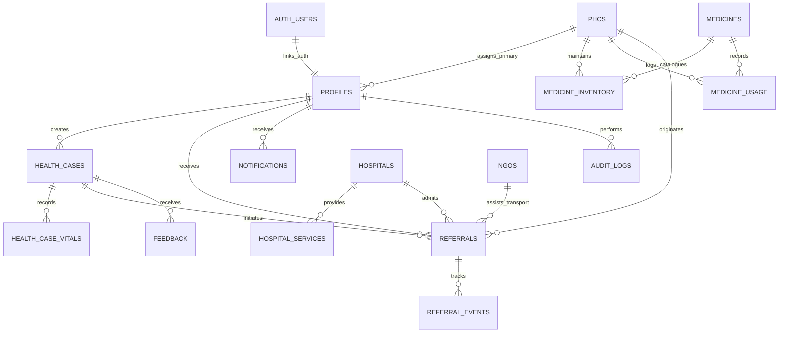

# JeevanSetu Database Architecture & Schema Documentation

This document describes the PostgreSQL relational database architecture, schema definitions, constraints, indexes, Supabase Auth linkages, and Row Level Security (RLS) policies for the **JeevanSetu** healthcare platform.

---

## 1. Design Principles

1. **Entity Identification**: Primary keys use `UUID` generated via `gen_random_uuid()` for distributed uniqueness and security.
2. **Referential Integrity**:
   - Healthcare cases with active referrals use `ON DELETE RESTRICT` to prevent accidental deletion of clinical audit histories.
   - Child logs and event timelines (e.g. `referral_events`, `health_case_vitals`) use `ON DELETE CASCADE` from their parent record.
   - `profiles.user_id` links directly to `auth.users(id)` with `ON DELETE CASCADE`.
3. **Timestamps**: All tables track `created_at` (`TIMESTAMPTZ DEFAULT NOW()`) and dynamic `updated_at` timestamps managed by PostgreSQL triggers.
4. **Data Isolation & Healthcare Privacy**: Personal identifiers (`profiles`) and clinical cases (`health_cases`) are normalized separately from facility logs.
5. **Least-Privilege RLS Enforcement**: Row Level Security is active on all application tables. Public registration strictly defaults to the `'patient'` role, and normal users are barred by trigger from self-escalating roles.

---

## 2. Entity Relationship Diagram

---

## 3. Core Relational Tables & Schema Details

### 1. `profiles`
User profile information for all stakeholders (Patient, PHC Staff, Doctor, Hospital Staff, NGO, District Admin).
- **Primary Key**: `id UUID`
- **Foreign Keys**: `user_id REFERENCES auth.users(id) ON DELETE CASCADE`, `assigned_phc_id REFERENCES phcs(id)`
- **Key Fields**: `full_name`, `phone`, `email`, `date_of_birth`, `gender`, `blood_group`, `village`, `taluka`, `district`, `state`, `abha_id`, `ration_card_number`, `pmjay_status`, `role`

### 2. `phcs`
Primary Health Centres registry in underserved and rural areas.
- **Primary Key**: `id UUID`
- **Key Fields**: `facility_code` (UNIQUE), `name`, `contact_phone`, `taluka`, `district`, `state`, `latitude`, `longitude`, `is_verified`, `operational_hours`

### 3. `hospitals`
Secondary & tertiary district hospitals and government medical colleges.
- **Primary Key**: `id UUID`
- **Key Fields**: `facility_code` (UNIQUE), `name`, `hospital_type`, `total_beds`, `icu_beds`, `empanelled_schemes`, `district`, `state`, `is_verified`

### 4. `hospital_services`
Departmental OPDs and specialty units with live doctor on-duty status.
- **Primary Key**: `id UUID`
- **Foreign Keys**: `hospital_id REFERENCES hospitals(id) ON DELETE CASCADE`
- **Key Fields**: `service_name`, `doctor_on_duty_status`, `is_active`

### 5. `doctors`
Physician and medical specialist registry.
- **Primary Key**: `id UUID`
- **Foreign Keys**: `profile_id REFERENCES profiles(id)`, `phc_id REFERENCES phcs(id)`, `hospital_id REFERENCES hospitals(id)`
- **Key Fields**: `medical_council_id` (UNIQUE), `full_name`, `specialization`, `facility_type`, `is_on_duty`, `is_verified`

### 6. `ngos`
Verified NGO partners providing patient transport and emergency grants.
- **Primary Key**: `id UUID`
- **Key Fields**: `ngo_darpan_id` (UNIQUE), `name`, `aid_focus`, `coordinator_name`, `contact_phone`, `district`, `state`, `is_verified`

### 7. `government_schemes`
Public health financial assistance schemes.
- **Primary Key**: `id UUID`
- **Key Fields**: `scheme_code` (UNIQUE, e.g. `PMJAY`, `MJPJAY`, `JSSK`), `name`, `description`, `benefits_summary`, `eligibility_criteria`, `is_active`

### 8. `health_cases`
Patient healthcare coordination cases.
- **Primary Key**: `id UUID`
- **Foreign Keys**: `patient_id REFERENCES profiles(id)`, `initial_phc_id REFERENCES phcs(id)`
- **Key Fields**: `case_number` (UNIQUE, e.g. `JVS-MH-7A82K1`), `caregiver_mode`, `primary_concern`, `category`, `urgency`, `status`

### 9. `health_case_vitals`
Clinical observations and vitals recorded during triage.
- **Primary Key**: `id UUID`
- **Foreign Keys**: `case_id REFERENCES health_cases(id) ON DELETE CASCADE`, `recorded_by_id REFERENCES profiles(id)`
- **Key Fields**: `systolic_bp`, `diastolic_bp`, `blood_sugar`, `hemoglobin`, `temperature`, `pulse_rate`, `notes`

### 10. `referrals`
Multi-stage referral lifecycle from PHC to Hospital.
- **Primary Key**: `id UUID`
- **Foreign Keys**: `case_id REFERENCES health_cases(id)`, `patient_id REFERENCES profiles(id)`, `originating_phc_id REFERENCES phcs(id)`, `destination_hospital_id REFERENCES hospitals(id)`, `ngo_transport_id REFERENCES ngos(id)`
- **Key Fields**: `referral_number` (UNIQUE), `required_specialty`, `clinical_summary`, `status`, `priority`, `estimated_travel_distance_km`

### 11. `referral_events`
Immutable timeline events tracking the 6-stage referral progress.
- **Primary Key**: `id UUID`
- **Foreign Keys**: `referral_id REFERENCES referrals(id) ON DELETE CASCADE`, `actor_id REFERENCES profiles(id)`
- **Key Fields**: `stage` (`created`, `patient_notified`, `destination_accepted`, `patient_reached`, `treatment_started`, `completed`), `event_title`, `note`, `metadata`

### 12. `medicines`
Master catalogue of essential drugs and supplies.
- **Primary Key**: `id UUID`
- **Key Fields**: `medicine_code` (UNIQUE), `name`, `generic_name`, `dosage_form`, `standard_unit`, `is_essential`

### 13. `medicine_inventory`
Live stock surveillance per PHC facility.
- **Primary Key**: `id UUID`
- **Foreign Keys**: `phc_id REFERENCES phcs(id)`, `medicine_id REFERENCES medicines(id)`
- **Unique Constraint**: `(phc_id, medicine_id)`
- **Key Fields**: `current_quantity`, `minimum_threshold`, `batch_number`, `expiry_date`, `last_restocked_at`

### 14. `medicine_usage`
Historical consumption records for depletion calculation and forecasting.
- **Primary Key**: `id UUID`
- **Foreign Keys**: `phc_id REFERENCES phcs(id)`, `medicine_id REFERENCES medicines(id)`
- **Key Fields**: `quantity_consumed`, `recorded_date`, `usage_context`

### 15. `feedback`
Patient and citizen service feedback (anonymous missed-call, IVR, web).
- **Primary Key**: `id UUID`
- **Foreign Keys**: `case_id REFERENCES health_cases(id)`, `phc_id REFERENCES phcs(id)`, `hospital_id REFERENCES hospitals(id)`
- **Key Fields**: `rating` (1-5), `category`, `service_tag`, `feedback_channel` (`WEB`, `IVR`, `MISSED_CALL`), `language` (`hi`, `mr`, `en`), `message`, `is_anonymous`, `contact_name`, `contact_phone`, `moderation_status`, `status`

### 16. `feedback_quality_signals`
Operational service quality alerts triggered by complaint clusters or negative trends.
- **Primary Key**: `id UUID`
- **Foreign Keys**: `phc_id REFERENCES phcs(id)`, `hospital_id REFERENCES hospitals(id)`, `acknowledged_by REFERENCES profiles(id)`
- **Key Fields**: `signal_type`, `severity`, `title`, `description`, `status` (`active`, `acknowledged`, `under_review`, `resolved`), `review_notes`

### 17. `notifications`
System, SMS, and in-app alerts.
- **Primary Key**: `id UUID`
- **Foreign Keys**: `recipient_id REFERENCES profiles(id) ON DELETE CASCADE`
- **Key Fields**: `type`, `title`, `message`, `channel`, `is_read`, `delivery_status`

### 18. `ivr_sessions`
Short-lived state tracking for no-smartphone IVR voice calls.
- **Primary Key**: `id UUID`
- **Key Fields**: `session_id` (UNIQUE), `caller_phone`, `caller_phone_masked`, `language` (`hi`, `mr`, `en`), `current_menu`, `step`, `is_verified`, `verified_patient_id REFERENCES profiles(id)`, `failed_attempts`, `expires_at`

### 19. `ivr_call_logs`
Operational call logs for debugging and aggregate metrics.
- **Primary Key**: `id UUID`
- **Key Fields**: `session_id`, `caller_phone_masked`, `language`, `flow_outcome`, `duration_seconds`, `menus_navigated`

### 20. `ivr_followup_requests`
Queue for patients requesting a health-worker callback via IVR.
- **Primary Key**: `id UUID`
- **Foreign Keys**: `patient_id REFERENCES profiles(id)`, `assigned_phc_id REFERENCES phcs(id)`, `assigned_staff_id REFERENCES profiles(id)`
- **Key Fields**: `caller_phone_masked`, `preferred_language`, `reason`, `status` (`pending`, `contacted`, `resolved`), `staff_notes`

### 21. `medicine_stock_transactions`
Ledger of all stock receipts, dispensations, adjustments, damages, and transfers.
- **Primary Key**: `id UUID`
- **Foreign Keys**: `phc_id REFERENCES phcs(id)`, `medicine_id REFERENCES medicines(id)`, `performed_by REFERENCES profiles(id)`
- **Key Fields**: `transaction_type` (`RECEIPT`, `DISPENSATION`, `ADJUSTMENT`, `DAMAGE`, `EXPIRY`), `quantity_delta`, `resulting_quantity`, `batch_number`, `expiry_date`, `reason`

### 22. `medicine_replenishment_requests`
Operational PHC-to-District replenishment request state machine.
- **Primary Key**: `id UUID`
- **Foreign Keys**: `phc_id REFERENCES phcs(id)`, `medicine_id REFERENCES medicines(id)`, `requested_by REFERENCES profiles(id)`, `reviewed_by REFERENCES profiles(id)`
- **Key Fields**: `request_number`, `requested_quantity`, `approved_quantity`, `received_quantity`, `priority` (`routine`, `urgent`, `emergency`), `status` (`DRAFT`, `REQUESTED`, `APPROVED`, `REJECTED`, `DISPATCHED`, `RECEIVED`, `CANCELLED`), `review_notes`, `dispatched_at`, `received_at`

### 23. `doctor_duty_schedules`
Duty schedule allocations for medical officers and specialists across rural facilities.
- **Primary Key**: `id UUID`
- **Foreign Keys**: `doctor_id REFERENCES doctors(id)`, `phc_id REFERENCES phcs(id)`
- **Key Fields**: `duty_date`, `scheduled_start`, `scheduled_end`, `status` (`SCHEDULED`, `ACTIVE`, `COMPLETED`, `CANCELLED`), `notes`

### 24. `doctor_presence_sessions`
Active and historical doctor presence sessions with authoritative server timestamps.
- **Primary Key**: `id UUID`
- **Foreign Keys**: `doctor_id REFERENCES doctors(id)`, `phc_id REFERENCES phcs(id)`, `schedule_id REFERENCES doctor_duty_schedules(id)`
- **Key Fields**: `check_in_at`, `check_out_at`, `duty_duration_minutes`, `status` (`ACTIVE`, `CHECKED_OUT`, `INCOMPLETE`, `INVALID`), `verification_method` (`authenticated_app`, `facility_kiosk`, `manual_roster`), `total_encounters_count`, `last_encounter_at`, `sync_status` (`SYNCED`, `PENDING_SYNC`, `DATA_STALE`), `last_synced_at`

### 25. `doctor_operational_flags`
Non-punitive operational review indicators flagging discrepancies between scheduled duty, presence sessions, and recorded patient encounters.
- **Primary Key**: `id UUID`
- **Foreign Keys**: `doctor_id REFERENCES doctors(id)`, `phc_id REFERENCES phcs(id)`, `duty_session_id REFERENCES doctor_presence_sessions(id)`, `reviewed_by REFERENCES profiles(id)`
- **Key Fields**: `anomaly_type` (`NO_ENCOUNTERS_DURING_DUTY`, `CHECKIN_WITHOUT_SCHEDULE`, `UNUSUAL_SESSION_DURATION`, `MISSING_CHECKOUT`, `MULTIPLE_ACTIVE_SESSIONS`, `ENCOUNTER_OUTSIDE_DUTY_WINDOW`), `severity` (`INFO`, `LOW`, `MEDIUM`, `HIGH`), `status` (`OPEN`, `UNDER_REVIEW`, `RESOLVED`, `DISMISSED`), `observed_at`, `evidence_summary`, `explanation_category` (`OUTREACH`, `ADMIN_DUTY`, `TRAINING`, `EMERGENCY_DEPLOYMENT`, `NETWORK_OUTAGE`, `PHC_CLOSED`, `LEAVE`, `OTHER`), `review_notes`, `reviewed_at`, `metrics`

### 26. `doctor_operational_reviews`
Immutable audit ledger capturing all administrative actions applied to doctor operational review flags.
- **Primary Key**: `id UUID`
- **Foreign Keys**: `flag_id REFERENCES doctor_operational_flags(id)`, `reviewer_id REFERENCES profiles(id)`
- **Key Fields**: `action` (`ACKNOWLEDGE`, `DISMISS`, `RESOLVE`, `ADD_NOTE`), `notes`, `metadata`, `created_at`

### 27. `feedback_interactions`
Multi-channel interaction session state for Missed-Call callbacks, IVR voice sessions, and SMS interactions.
- **Primary Key**: `id UUID`
- **Foreign Keys**: `feedback_id REFERENCES feedback(id) ON DELETE SET NULL`
- **Key Fields**: `interaction_type` (`MISSED_CALL`, `IVR`, `SMS`, `WEB`), `caller_hash`, `caller_phone_masked`, `session_token` (UNIQUE), `language` (`hi`, `mr`, `en`), `dtmf_log`, `current_state`, `status` (`INITIATED`, `IN_PROGRESS`, `COMPLETED`, `EXPIRED`, `FAILED`), `expires_at`

### 28. `public_health_early_warnings`
Public health operational anomaly detection signals and multi-stream surveillance alerts (Phase 27).
- **Primary Key**: `id UUID`
- **Foreign Keys**: `location_id REFERENCES phcs(id)`, `reviewed_by_id REFERENCES profiles(id)`
- **Key Fields**: `geographic_scope` (`phc`, `taluka`, `district`, `village`), `location_name`, `district`, `taluka`, `village`, `signal_type` (`MULTI_SOURCE_SIGNAL`, `CASE_TREND_ANOMALY`, `MEDICINE_USAGE_ANOMALY`, `COMMUNITY_FEEDBACK_ANOMALY`, `ASHA_OBSERVATION_ANOMALY`), `severity` (`INFO`, `LOW`, `MEDIUM`, `HIGH`), `confidence` (`LOW`, `MEDIUM`, `HIGH`), `status` (`DETECTED`, `UNDER_REVIEW`, `VERIFIED`, `DISMISSED`, `RESOLVED`), `data_quality` (`HIGH`, `MEDIUM`, `LOW`, `UNAVAILABLE`, `DATA_STALE`), `observed_value`, `baseline_value`, `deviation_percentage`, `z_score`, `signal_score`, `contributing_sources`, `evidence`, `ai_summary`, `ai_explanations`, `ai_limitations`, `recommended_review_questions`, `notes`, `resolution_category`, `resolution_notes`, `dedup_key` (UNIQUE), `is_stale`

### 29. `community_asha_reports`
Structured community field observations submitted by ASHAs and community health workers (Phase 27).
- **Primary Key**: `id UUID`
- **Foreign Keys**: `phc_id REFERENCES phcs(id)`, `reporter_id REFERENCES profiles(id)`
- **Key Fields**: `area_name`, `village`, `taluka`, `district`, `observation_type` (`FEVER_CLUSTER`, `DIARRHEA_CASES`, `WATER_CONTAMINATION`, `RESPIRATORY_CASES`, `OTHER`), `reported_count`, `report_date`, `source_role` (`ASHA`, `ANM`, `COMMUNITY_VOLUNTEER`), `reporter_name`, `notes`, `is_verified`

### 30. `public_health_reviews`
Immutable audit ledger capturing all human administrative reviews, verification actions, and dismissal classifications (Phase 27).
- **Primary Key**: `id UUID`
- **Foreign Keys**: `warning_id REFERENCES public_health_early_warnings(id)`, `reviewer_id REFERENCES profiles(id)`
- **Key Fields**: `action` (`ACKNOWLEDGE`, `REQUEST_INVESTIGATION`, `VERIFY`, `DISMISS`, `RESOLVE`, `ADD_NOTE`), `previous_status`, `new_status`, `resolution_category`, `notes`, `metadata`, `created_at`

### 31. `outbox_events`
Transactional outbox event ledger for asynchronous external provider dispatch and optional n8n orchestration (Phase 28).
- **Primary Key**: `id UUID`
- **Key Fields**: `event_type` (`REFERRAL_CREATED`, `REFERRAL_STATUS_CHANGED`, `MEDICINE_LOW_STOCK`, `MEDICINE_DEPLETION_WARNING`, `FEEDBACK_SUBMITTED`, `FEEDBACK_REVIEWED`, `EARLY_WARNING_CREATED`, `EARLY_WARNING_VERIFIED`, `CALLBACK_REQUESTED`, `NOTIFICATION_REQUESTED`), `aggregate_type`, `aggregate_id`, `payload` (JSONB, sanitized/PII minimized), `status` (`PENDING`, `PROCESSING`, `SENT`, `FAILED`, `RETRYING`, `ABANDONED`), `retry_count`, `max_retries`, `backoff_multiplier`, `last_attempted_at`, `next_retry_at`, `error_category`, `error_message`, `idempotency_key` (UNIQUE), `n8n_dispatched`, `n8n_response_status`, `metadata`

### 32. `outbox_event_logs`
Immutable dispatch and attempt history for each outbox event (Phase 28).
- **Primary Key**: `id UUID`
- **Foreign Keys**: `event_id REFERENCES outbox_events(id) ON DELETE CASCADE`
- **Key Fields**: `attempt_number`, `dispatcher` (`DIRECT_PROVIDER`, `N8N_ORCHESTRATOR`, `MANUAL_RETRY`), `target_channel` (`SMS`, `EMAIL`, `IVR`, `IN_APP`, `WEBHOOK`), `status` (`SUCCESS`, `FAILED`, `PROVIDER_NOT_CONFIGURED`, `TIMEOUT`), `duration_ms`, `response_code`, `error_details`, `created_at`

### 33. `user_notification_preferences`
User opt-in/opt-out configuration for transactional channels and domain updates (Phase 28).
- **Primary Key**: `id UUID`
- **Foreign Keys**: `user_id REFERENCES profiles(id) ON DELETE CASCADE` (UNIQUE)
- **Key Fields**: `enable_sms`, `enable_email`, `enable_in_app`, `enable_ivr_reminders`, `enable_referral_updates`, `enable_medicine_alerts`, `enable_duty_alerts`

### 34. `webhook_replay_nonces`
Replay attack prevention cache tracking processed event nonces (Phase 28).
- **Primary Key**: `id UUID`
- **Key Fields**: `nonce` (UNIQUE), `source`, `expires_at`, `created_at`

---

## 4. Migration Execution

1. **Initial Schema**: Run [`supabase/migrations/20260822000001_initial_schema.sql`](file:///c:/Users/shivb/OneDrive/Desktop/JeevanSetu/supabase/migrations/20260822000001_initial_schema.sql)
2. **Indexes**: Run [`supabase/migrations/20260822000002_indexes.sql`](file:///c:/Users/shivb/OneDrive/Desktop/JeevanSetu/supabase/migrations/20260822000002_indexes.sql)
3. **Auth Linkage & RLS**: Run [`supabase/migrations/20260822000003_auth_and_rls.sql`](file:///c:/Users/shivb/OneDrive/Desktop/JeevanSetu/supabase/migrations/20260822000003_auth_and_rls.sql)
4. **Referral Follow-ups**: Run [`supabase/migrations/20260822000006_referral_followups.sql`](file:///c:/Users/shivb/OneDrive/Desktop/JeevanSetu/supabase/migrations/20260822000006_referral_followups.sql)
5. **IVR System**: Run [`supabase/migrations/20260822000007_ivr_system.sql`](file:///c:/Users/shivb/OneDrive/Desktop/JeevanSetu/supabase/migrations/20260822000007_ivr_system.sql)
6. **Missed-Call Feedback**: Run [`supabase/migrations/20260822000008_missed_call_feedback.sql`](file:///c:/Users/shivb/OneDrive/Desktop/JeevanSetu/supabase/migrations/20260822000008_missed_call_feedback.sql)
7. **Medicine Supply Chain**: Run [`supabase/migrations/20260822000009_medicine_supply_chain.sql`](file:///c:/Users/shivb/OneDrive/Desktop/JeevanSetu/supabase/migrations/20260822000009_medicine_supply_chain.sql)
8. **Closed-Loop Care**: Run [`supabase/migrations/20260822000010_closed_loop_referrals.sql`](file:///c:/Users/shivb/OneDrive/Desktop/JeevanSetu/supabase/migrations/20260822000010_closed_loop_referrals.sql)
9. **Doctor Presence & Availability**: Run [`supabase/migrations/20260822000011_doctor_presence.sql`](file:///c:/Users/shivb/OneDrive/Desktop/JeevanSetu/supabase/migrations/20260822000011_doctor_presence.sql)
10. **Early-Warning Intelligence**: Run [`supabase/migrations/20260822000012_early_warning_intelligence.sql`](file:///c:/Users/shivb/OneDrive/Desktop/JeevanSetu/supabase/migrations/20260822000012_early_warning_intelligence.sql)
11. **Citizen Feedback Intelligence**: Run [`supabase/migrations/20260822000013_citizen_feedback_intelligence.sql`](file:///c:/Users/shivb/OneDrive/Desktop/JeevanSetu/supabase/migrations/20260822000013_citizen_feedback_intelligence.sql)
12. **Referral Continuity & Patient Journey**: Run [`supabase/migrations/20260822000014_referral_continuity_intelligence.sql`](file:///c:/Users/shivb/OneDrive/Desktop/JeevanSetu/supabase/migrations/20260822000014_referral_continuity_intelligence.sql)
13. **Stockout Prediction & Inventory Alerts**: Run [`supabase/migrations/20260822000015_medicine_stockout_prediction.sql`](file:///c:/Users/shivb/OneDrive/Desktop/JeevanSetu/supabase/migrations/20260822000015_medicine_stockout_prediction.sql)
14. **Doctor Attendance & Integrity Tracking**: Run [`supabase/migrations/20260822000016_doctor_attendance_integrity.sql`](file:///c:/Users/shivb/OneDrive/Desktop/JeevanSetu/supabase/migrations/20260822000016_doctor_attendance_integrity.sql)
15. **Referral Continuity & Treatment Completion**: Run [`supabase/migrations/20260822000017_referral_continuity_lifecycle.sql`](file:///c:/Users/shivb/OneDrive/Desktop/JeevanSetu/supabase/migrations/20260822000017_referral_continuity_lifecycle.sql)
16. **Medicine Inventory & Forecasting Extensions**: Run [`supabase/migrations/20260822000018_medicine_inventory_forecasting.sql`](file:///c:/Users/shivb/OneDrive/Desktop/JeevanSetu/supabase/migrations/20260822000018_medicine_inventory_forecasting.sql)
17. **Doctor Presence & Operational Accountability**: Run [`supabase/migrations/20260822000019_doctor_presence_accountability.sql`](file:///c:/Users/shivb/OneDrive/Desktop/JeevanSetu/supabase/migrations/20260822000019_doctor_presence_accountability.sql)
18. **Citizen Feedback System & Tracking**: Run [`supabase/migrations/20260822000020_citizen_feedback_system.sql`](file:///c:/Users/shivb/OneDrive/Desktop/JeevanSetu/supabase/migrations/20260822000020_citizen_feedback_system.sql)
19. **Public Health Early Warning & Outbreak Intelligence**: Run [`supabase/migrations/20260822000021_public_health_early_warning.sql`](file:///c:/Users/shivb/OneDrive/Desktop/JeevanSetu/supabase/migrations/20260822000021_public_health_early_warning.sql)
20. **Automation, n8n & Outbox Pattern**: Run [`supabase/migrations/20260822000022_automation_n8n_outbox.sql`](file:///c:/Users/shivb/OneDrive/Desktop/JeevanSetu/supabase/migrations/20260822000022_automation_n8n_outbox.sql)
21. **Seed Data**: Run [`supabase/seed.sql`](file:///c:/Users/shivb/OneDrive/Desktop/JeevanSetu/supabase/seed.sql)

---

## 5. Row Level Security (RLS) Policies Overview

- **`profiles`**:
  - `auth.uid() = user_id` for select and update.
  - Authorized medical officers (`phc_staff`, `doctor`, `hospital_staff`, `district_admin`) can read patient profiles for clinical coordination.
  - Trigger `trg_prevent_role_escalation` blocks normal users from altering their assigned `role`.
- **`health_cases` & `health_case_vitals`**:
  - Patients can only view and create their own cases (`patient_id = current_profile_id()`).
  - Authorized medical staff can view, update, and record clinical vitals.
- **`referrals` & `referral_events`**:
  - Patients can view their own referral records.
  - PHC staff create referrals; originating PHC and destination hospital staff can update referral stages and append timeline events.
- **`medicine_inventory` & `medicine_usage`**:
  - Public can view essential stock counts.
  - Only assigned PHC staff and District Admins can modify stock levels or log medicine dispensation.
- **`ivr_sessions`, `ivr_call_logs`, `ivr_followup_requests`**:
  - System service role manages session life-cycle.
  - PHC staff and district admins manage callback requests for their facility.
- **`feedback` & `feedback_interactions`**:
  - Anyone (authenticated or anonymous) can insert feedback records.
  - Anonymous status lookup is granted publicly exclusively via `tracking_token = current_setting('request.headers')::json->>'x-tracking-token'`.
  - Registered patients can only select their own authenticated feedback (`patient_id = current_profile_id()`).
  - Facility staff (`phc_staff`, `hospital_staff`) are scoped strictly to their assigned facility records.
  - District Administrators have district-wide read and review permissions.
- **`outbox_events` & `outbox_event_logs`**:
  - Read access restricted to `district_admin` role.
  - Service role / background worker possesses write/update permissions.
- **`user_notification_preferences`**:
  - Users can read and update only their own preference records (`user_id = auth.uid()`).
- **`notifications`**:
  - Users can read and mark as read only notifications sent to their profile (`recipient_id = current_profile_id()`).
- **`audit_logs`**:
  - Read-only restricted to `district_admin`.

---

## 6. Backup, Point-In-Time Recovery (PITR) & Disaster Recovery (Phase 29)

- **PostgreSQL / Supabase Automated Backups**:
  - Production instances utilize automated daily snapshots and continuous Write-Ahead Logging (WAL) for Point-In-Time Recovery (PITR) with up to 7-day rollback windows.
- **Pre-Migration Snapshots**:
  - Execute full database schema and data exports (`pg_dump -Fc`) before applying destructive or major structural migrations.
- **Destructive Restore Invariant**:
  - *"Never execute destructive database restore operations automatically. All database restore procedures must remain explicit, audited manual operations with pre-restore snapshots."*
- **Database Readiness Probes**:
  - Evaluated via `GET /api/health/ready` checking connectivity latency without exposing credentials.

---

## 7. Row Level Security (RLS) Matrix & Security Hardening (Phase 30)

| Database Table | Public Anon Access | Authenticated Patient | PHC / Hospital Staff | District Administrator |
|---|---|---|---|---|
| `profiles` | `DENIED` | `SELECT`/`UPDATE` own | `SELECT` patients under care | `SELECT`/`UPDATE` all in district |
| `doctors` | `SELECT` active registry | `SELECT` | `SELECT` / `UPDATE` own profile | `SELECT`/`UPDATE` all |
| `health_cases` | `DENIED` | `SELECT`/`INSERT` own | `SELECT`/`UPDATE` assigned facility | `SELECT`/`UPDATE` all |
| `health_case_vitals` | `DENIED` | `SELECT` own | `SELECT`/`INSERT` assigned facility | `SELECT` all |
| `referrals` | `DENIED` | `SELECT` own | `SELECT`/`UPDATE` facility scoped | `SELECT`/`UPDATE` all |
| `referral_events` | `DENIED` | `SELECT` own timeline | `SELECT`/`INSERT` facility scoped | `SELECT` all |
| `medicine_inventory` | `SELECT` (counts only) | `SELECT` | `SELECT`/`UPDATE` assigned PHC | `SELECT`/`UPDATE` all |
| `medicine_usage` | `DENIED` | `DENIED` | `SELECT`/`INSERT` assigned PHC | `SELECT` all |
| `feedback` | `INSERT` (anonymous) | `SELECT`/`INSERT` own | `SELECT`/`UPDATE` assigned facility | `SELECT`/`UPDATE` all |
| `feedback_interactions` | `DENIED` | `DENIED` | `SELECT` assigned facility | `SELECT` all |
| `public_health_early_warnings` | `DENIED` | `DENIED` | `SELECT` assigned facility | `SELECT`/`UPDATE` all |
| `community_asha_reports` | `DENIED` | `DENIED` | `SELECT`/`INSERT` assigned facility | `SELECT`/`UPDATE` all |
| `public_health_reviews` | `DENIED` | `DENIED` | `SELECT` assigned facility | `SELECT`/`INSERT` all |
| `outbox_events` | `DENIED` | `DENIED` | `DENIED` | `SELECT`/`UPDATE` (retry) |
| `user_notification_preferences` | `DENIED` | `SELECT`/`UPDATE` own | `SELECT`/`UPDATE` own | `SELECT`/`UPDATE` own |
| `audit_logs` | `DENIED` | `DENIED` | `DENIED` | `SELECT` (Read-only immutable) |

---

## 8. Database Migration Strategy, Ordering & Seed Data Isolation (Phase 31)

### A. Chronological Migration Order
All database changes are tracked via 22 numbered, ordered, and idempotent SQL migrations in `supabase/migrations/`:
1. `20260822000001_initial_schema.sql` (Core profiles, facilities, cases, vitals, inventory)
2. `20260822000002_indexes.sql` (Performance indexing)
3. `20260822000003_auth_and_rls.sql` (Core RLS policies)
4. `20260822000004` to `20260822000019` (Domain feature enhancements)
5. `20260822000020_citizen_feedback_system.sql` (Feedback tracking and anonymous isolation)
6. `20260822000021_public_health_early_warning.sql` (Early warning and ASHA reports)
7. `20260822000022_automation_n8n_outbox.sql` (Transactional outbox events and notification preferences)

### B. Forward-Fix Principle vs Destructive Rollback
- Production migrations must be **additive** (adding new columns as nullable, creating new tables, creating indexes).
- **Rollback Rule**: In production, do not run `DROP TABLE` or `ROLLBACK` on live healthcare data. If a schema bug is discovered, write and deploy a new forward migration (`20260822000023_...sql`).

### C. Seed Data Isolation
- Development mock data (synthetic demo patients, mock doctors, sample feedback) is strictly confined to local development stores.
- Production and staging databases are initialized using pure schema migrations without synthetic records.

