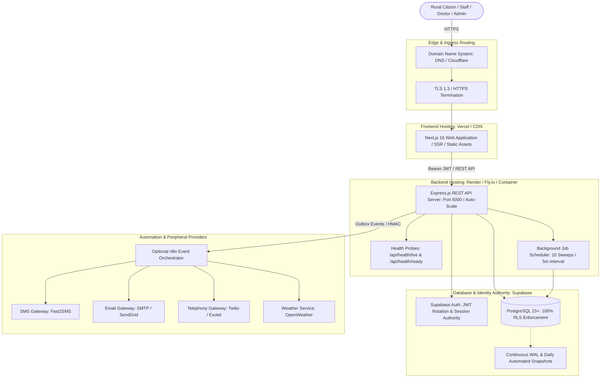

# JeevanSetu Production Deployment & Release Engineering Guide

## 1. Production Deployment Architecture



---

## 2. Environment Separation Matrix

| Configuration Domain | Local Development (`.env.development`) | Staging (`.env.staging`) | Production (`.env.production`) |
|---|---|---|---|
| **`NODE_ENV`** | `development` | `staging` | `production` |
| **`APP_ENV`** | `development` | `staging` | `production` |
| **`PORT`** | `5000` (Local) | Assigned by PaaS (`$PORT`) | Assigned by PaaS (`$PORT`) |
| **`FRONTEND_URL`** | `http://localhost:3000` | `https://staging.jeevansetu.internal` | `https://jeevansetu.gov.in` |
| **`SUPABASE_URL`** | Local / Dev Sandbox Project | Dedicated Staging Project | Dedicated Isolated Production Project |
| **`MOCK_PROVIDERS`** | `true` (Zero paid services) | `false` (Sandbox / Test API keys) | `false` (Live production credentials) |
| **`N8N_ENABLED`** | `false` (Internal direct handling) | `true` (Staging n8n workflow) | `true` (Production n8n orchestrator) |
| **`LOG_LEVEL`** | `DEBUG` | `INFO` | `INFO` |
| **`RATE_LIMITING`** | Permissive (300 req/min) | Enforced (300 req/min) | Strict (300 req/min global, 30/15m auth) |

---

## 3. Recommended Deployment Targets

### A. Frontend (Next.js 16)
- **Primary Target**: **Vercel** / **Netlify** / **Node Container**.
- **Build Command**: `npm run build`
- **Output Directory**: `.next`
- **Required Environment Variables**:
  - `NEXT_PUBLIC_BACKEND_URL`: `https://api.jeevansetu.gov.in`
  - `NEXT_PUBLIC_SUPABASE_URL`: `https://[prod-id].supabase.co`
  - `NEXT_PUBLIC_SUPABASE_ANON_KEY`: `[prod-anon-key]`
  - `NEXT_PUBLIC_APP_VERSION`: `1.0.0`
  - `NEXT_PUBLIC_APP_ENV`: `production`

### B. Backend API (Express.js)
- **Primary Target**: **Render** / **Fly.io** / **Railway** / **Docker Container**.
- **Runtime**: Node.js 20.x Alpine.
- **Build Command**: `npm ci --only=production`
- **Start Command**: `npm run start` (or `node server.js`).
- **Health Probes**:
  - Liveness: `GET /api/health/live`
  - Readiness: `GET /api/health/ready`
- **Graceful Shutdown**: Automatically traps `SIGTERM` and `SIGINT`, closes server connections, stops background sweeps, and exits cleanly.

### C. Database & Authentication (Supabase PostgreSQL)
- **Primary Target**: **Supabase Managed Platform** or **Self-Hosted PostgreSQL**.
- **Extensions**: `pgcrypto`, `uuid-ossp`.
- **Migrations**: Applied sequentially via Supabase CLI (`supabase db push`) or migration scripts.
- **RLS**: 100% of sensitive tables enforce Row Level Security.

---

## 4. Sequential 10-Step Release Procedure

To prevent race conditions, broken contracts, or downtime during releases, follow this exact order:

```
Step 1: CI Verification (Tests, Lint, Build pass 100%)
  ↓
Step 2: Pre-Release Backup & PITR Snapshot Verification
  ↓
Step 3: Apply Database Migrations (supabase/migrations/*.sql)
  ↓
Step 4: Deploy Backend API (Render / Fly.io / Container)
  ↓
Step 5: Verify Backend Health (GET /api/health/ready returns 200)
  ↓
Step 6: Deploy Frontend (Vercel / Netlify)
  ↓
Step 7: Verify Authentication & Redirect URLs
  ↓
Step 8: Execute Post-Deployment Smoke Tests (Synthetic non-destructive test)
  ↓
Step 9: Verify Automation & Webhook Integration (n8n & Outbox sweeps)
  ↓
Step 10: Verify Observability (Error rates, Request IDs, Logs at /admin/operations)
```

---

## 5. Domain, DNS, HTTPS & CORS Readiness

- **HTTPS Invariant**: Production must terminate TLS 1.3 over port 443 with HSTS enabled.
- **CORS Whitelist**:
  - In Development: Allows `http://localhost:3000`.
  - In Production: Restricts origin strictly to configured `FRONTEND_URL`. Wildcard (`*`) CORS is completely disabled.
- **Supabase Auth Redirect URLs**:
  - Development: `http://localhost:3000/**`
  - Staging: `https://staging.jeevansetu.internal/**`
  - Production: `https://jeevansetu.gov.in/**`
  *(Development and production URLs must never be mixed in the same Supabase project).*

---

## 6. Rollback Procedures & Database Forward-Migration Invariant

### A. Frontend Rollback
- **Mechanism**: Instant atomic rollback via Vercel/PaaS deployment dashboard to previous known-good deployment SHA.
- **Downtime**: Zero downtime.

### B. Backend Rollback
- **Mechanism**: Re-deploy previous container image tag or redeploy previous git commit SHA.
- **Downtime**: $< 30$ seconds (zero downtime with rolling deployment).

### C. Database Rollback Limitations
- **CRITICAL INVARIANT**: *"Never execute destructive database rollbacks automatically against production."*
- **Additive / Non-Destructive Migrations**: All migrations must be backwards-compatible (e.g. add columns as nullable, add tables, add views).
- **Forward-Fix Principle**: If a migration introduces a schema issue, deploy a new forward migration (`20260822000023_fix_...sql`) rather than running `DROP TABLE` or `ROLLBACK` on live patient data.
- **Disaster Restore**: In catastrophic scenarios, restore from pre-release Point-In-Time snapshot following runbooks in [`docs/disaster-recovery.md`](file:///c:/Users/shivb/OneDrive/Desktop/JeevanSetu/docs/disaster-recovery.md).

---

## 7. Graceful Degradation & Maintenance Mode

- **Optional Provider Failures**: If SMS, Email, Telephony, Weather, or n8n are offline, the backend continues serving core consultations, case registration, and referral coordination without crashing.
- **Planned Maintenance**: When deploying major infrastructure updates, configure edge routing to return a friendly maintenance banner:
  > *"JeevanSetu is currently undergoing scheduled maintenance. Direct emergency services remain active (Call 108). All clinical records remain secure."*
