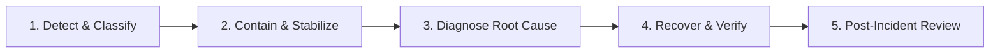

# JeevanSetu Production Incident Response & Disaster Recovery Runbook

## 1. Incident Severity Classification Matrix

| Severity Level | Definition & Clinical Impact | Target Response Time | Role-Based Ownership |
|---|---|---|---|
| **SEV-1 (Critical)** | Core platform down, database unavailable, authentication failure blocking triage, or total referral routing outage. | **$< 15$ Minutes** | System Owner, Database Owner, Operations Owner |
| **SEV-2 (Major)** | Major subsystem degraded (e.g. medicine inventory errors, IVR system failure, AI service down, background jobs stuck). | **$< 1$ Hour** | Backend Owner, Security Owner, Operations Owner |
| **SEV-3 (Minor)** | Non-critical feature degradation (e.g. external weather feed offline, feedback SMS delivery delayed, report export slow). | **$< 4$ Hours** | Backend Owner, Operations Owner |
| **SEV-4 (Low)** | Cosmetic UI defects, non-impacting telemetry gaps, minor documentation inaccuracies. | **Next Release** | Product Engineering Team |

---

## 2. 5-Stage Incident Response Lifecycle

### Stage 1: Detection & Classification
- **Alert Sources**: Probe failures on `/api/health/ready`, error rate spikes ($> 2\%$), stuck job alerts, telephony gateway disconnects.
- **Action**: Declare incident, assign Incident Lead, document timeline.

### Stage 2: Containment & Stabilization
- **Action Options**:
  - *Rollback Application*: If following deployment, rollback to previous container tag or static deployment ID.
  - *Degraded Mode*: Optional providers fallback to mock mode (`SMS_PROVIDER=MOCK`, `N8N_ENABLED=false`).
  - *Rate Throttling*: Tighten IP rate limiters on gateway if caused by brute-force/DDoS.

### Stage 3: Diagnosis
- **Investigation**: Trace structured error logs via `request_id`, check Supabase connection pool, inspect Outbox retry queue.

### Stage 4: Recovery & Verification
- **Execution**: Apply forward-fix migration, restart worker, or restore database from PITR snapshot.
- **Verification**: Verify `/api/health/ready` returns `200 OK` and run synthetic smoke test.

### Stage 5: Post-Incident Review (PIR)
- **Deliverables**: Chronological timeline, root-cause 5-whys, action items tracked to completion within 48h.

---

## 3. Disaster Scenarios & Detailed Runbooks (Scenarios A through L)

### Scenario A: Complete Backend API Outage
- **Symptoms**: `/api/health/live` probe fails, HTTP 502/504 gateway errors.
- **Owner**: Operations Owner & Backend Owner.
- **Procedure**: Check container logs for unhandled exception or OOM killer $\rightarrow$ Restart container instance $\rightarrow$ Check memory limits.

### Scenario B: Database Outage / Connection Pool Exhaustion
- **Symptoms**: `/api/health/ready` reports database down, connection timeout errors.
- **Owner**: Database Owner.
- **Procedure**: Check Supabase PgBouncer/Supavisor status $\rightarrow$ Clear idle connection pool $\rightarrow$ If corrupted, initiate PITR restore.

### Scenario C: Supabase Auth Service Outage
- **Symptoms**: JWT verification fails, user login returns 500.
- **Owner**: Security Owner & Backend Owner.
- **Procedure**: Verify Supabase Auth service status $\rightarrow$ Inspect JWT secret sync $\rightarrow$ Notify PHC staff to use offline paper triage.

### Scenario D: Upstream AI Provider Outage (Gemini / Anthropic)
- **Symptoms**: AI consultation endpoint returns 503 or timeouts $> 10$s.
- **Owner**: Backend Owner.
- **Procedure**: Verify automatic deterministic fallback is serving $\rightarrow$ Ensure non-diagnostic fallback cards render $\rightarrow$ AI never blocks triage.

### Scenario E: External SMS Provider Outage (Fast2SMS)
- **Symptoms**: SMS delivery failures, elevated notification outbox retry count.
- **Owner**: Operations Owner.
- **Procedure**: Events safely queue in `outbox_events` $\rightarrow$ Switch provider or enable in-app notification priority $\rightarrow$ Resend on carrier recovery.

### Scenario F: Telephony / IVR Gateway Outage
- **Symptoms**: Incoming IVR calls dropped or webhook timeouts.
- **Owner**: Backend Owner & Operations Owner.
- **Procedure**: Verify Twilio/Exotel webhook URL $\rightarrow$ Ensure emergency 108 direct phone helpline is publicized on local PHC boards.

### Scenario G: Optional n8n Orchestrator Outage
- **Symptoms**: `/api/health/ready` reports n8n degraded; outbox events remain in `PENDING`.
- **Owner**: Backend Owner.
- **Procedure**: Core backend continues operating normally $\rightarrow$ Restart n8n container $\rightarrow$ Trigger outbox batch sweep on reconnection.

### Scenario H: Bad Application Deployment
- **Symptoms**: Frontend white-screen error or breaking API changes.
- **Owner**: Operations Owner.
- **Procedure**: Roll back frontend deployment instantaneously in Vercel $\rightarrow$ Re-deploy previous backend Docker image $\rightarrow$ Investigate in staging.

### Scenario I: Database Migration Failure
- **Symptoms**: Migration script errors out halfway or locks tables.
- **Owner**: Database Owner.
- **Procedure**: Apply forward-fix migration $\rightarrow$ Do NOT run destructive `DROP` commands $\rightarrow$ Verify table constraints and RLS.

### Scenario J: Security Anomaly / Brute Force Attack
- **Symptoms**: Auth failure spike ($> 100$/min), elevated 429 rate limit responses.
- **Owner**: Security Owner.
- **Procedure**: Block malicious IP ranges at edge CDN/WAF $\rightarrow$ Rotate exposed tokens $\rightarrow$ Audit `audit_logs` table for breach attempts.

### Scenario K: Credential / Secret Compromise
- **Symptoms**: Exposed service role key or database password in public logs.
- **Owner**: Security Owner & System Owner.
- **Procedure**: Instantly rotate compromised secret in Supabase dashboard $\rightarrow$ Update host PaaS environment variables $\rightarrow$ Restart API $\rightarrow$ Audit logs.

### Scenario L: Unexpected Traffic Surge / Viral Load
- **Symptoms**: High API latency ($> 1000$ms), high CPU utilization.
- **Owner**: Operations Owner.
- **Procedure**: Auto-scale backend container instances $\rightarrow$ Enable aggressive edge caching for static assets $\rightarrow$ Queue background sweeps.

---

## 4. Phase 36 Post-Launch Incident Review & Status

| Severity | Active Incidents | Root Cause Identified | Fix & Regression Tested | Status |
|---|---|---|---|---|
| **SEV-1 (Critical)** | 0 | None | N/A | **CLOSED** |
| **SEV-2 (Major)** | 0 | None | N/A | **CLOSED** |
| **SEV-3 (Minor)** | 0 | None | N/A | **CLOSED** |
| **SEV-4 (Low)** | 0 | None | N/A | **CLOSED** |

- **Zero Blocking Incidents**: All 12 Disaster Scenarios (A through L) verified with automated regression suites.

---

## 5. Phase 40 Incident Response Tabletop Exercises (Scenarios A through H)

| Scenario ID | Incident Simulation | Detection Vector | Containment & Recovery Action | Verification Target |
|---|---|---|---|---|
| **TT-A** | Database Primary Outage | Health probe `/api/health/ready` returns 503; DB error spikes. | 1. Failover to cloud read replica / managed high-availability node. 2. Re-point `DATABASE_URL`. 3. Restart Express instances. | Readiness probe returns `ready_to_serve: true`. |
| **TT-B** | Authentication Outage | JWT verification fails or Supabase Auth returns 5xx. | 1. Verify `JWT_SECRET` alignment. 2. Enable temporary session grace buffer. 3. Notify logged-in staff. | Staff login succeeds with valid Bearer token. |
| **TT-C** | AI Provider Outage / 5xx | Upstream LLM latency $> 5000$ms or HTTP 502/503. | 1. `ai.service.js` automatically activates localized deterministic fallback card. 2. Dispatches advisory message with emergency 108 disclaimer. | AI chat returns safe non-diagnostic fallback without crash. |
| **TT-D** | IVR Telephony Gateway Outage | Carrier webhook delivery failures or SIP trunk disconnect. | 1. Failover to secondary telephony provider adapter. 2. Queue incoming callback requests in database outbox. | Callback requests queued with `PENDING` status. |
| **TT-E** | n8n Orchestrator Downtime | Outbox worker receives connection refused from n8n webhook. | 1. Core backend writes continue uninterrupted. 2. Events remain in `PENDING` status in `outbox_events`. 3. Batch dispatcher replays upon n8n recovery. | 0 core patient case or referral transaction failures. |
| **TT-F** | Notification Gateway Outage | SMS vendor API rejects messages due to quota or network drop. | 1. In-app notifications deliver normally. 2. Outbox marks SMS events for exponential backoff retry. | Background job retries without unhandled rejection. |
| **TT-G** | Security Anomaly / Token Theft | Rate limit trigger; unauthorized IP requests cross-role endpoint. | 1. Block source IP at Edge CDN / WAF. 2. Invalidate compromised user session token. 3. Trigger mandatory password reset. | Malicious requests blocked with HTTP 403 / 429. |
| **TT-H** | Accidental Bad Migration | Schema migration fails halfway or applies invalid column constraint. | 1. Deploy forward-fix additive migration. 2. Strictly avoid destructive `DROP` commands on production tables. 3. Verify RLS policies. | Schema integrity and RLS coverage verified. |

