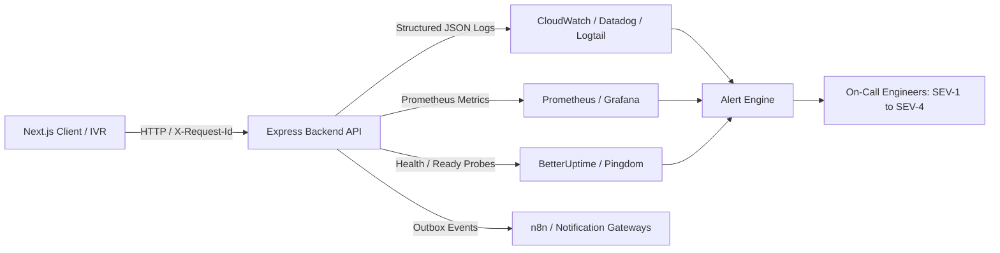

# JeevanSetu Production Monitoring, Alerting & Observability Guide

## 1. Observability Architecture
JeevanSetu uses a structured, low-overhead observability pipeline designed for high reliability and zero sensitive data leakage.

---

## 2. Core Service Level Objectives (SLOs)

| Metric | Target SLO | Measurement Window | Alert Trigger Threshold |
|---|---|---|---|
| **API Availability** | $\ge 99.9\%$ uptime | 30-day rolling | $< 99.5\%$ over 5 minutes |
| **API p95 Latency** | $\le 250$ms | 5-minute window | $> 1000$ms sustained for 5m |
| **5xx Error Rate** | $\le 0.1\%$ of total requests | 5-minute window | $> 1.0\%$ over 5m |
| **Database Pool Health** | 0 connection queue wait | 1-minute window | Pool exhaustion $> 90\%$ |
| **Outbox Queue Delay** | $\le 60$s processing latency | 5-minute window | Unprocessed events $> 100$ |

---

## 3. Actionable Production Alerting Matrix

| Alert Name | Condition | Severity | Primary Owner | First Response Action | Escalation Path |
|---|---|---|---|---|---|
| **`CRITICAL_API_OUTAGE`** | 3 consecutive probe failures on `/api/health/live` | **SEV-1** | Operations Owner | Check host container lifecycle & memory usage | System Owner |
| **`HIGH_5XX_RATE`** | 5xx error rate $> 2\%$ over 5 minutes | **SEV-2** | Backend Owner | Inspect structured error logs for unhandled exceptions | System Owner |
| **`DATABASE_UNAVAILABLE`** | `/api/health/ready` reports database down | **SEV-1** | Database Owner | Inspect Supabase pooler, network routing, and credentials | Operations Owner |
| **`AUTH_FAILURE_SPIKE`** | Failed logins $> 50$ in 5 minutes | **SEV-2** | Security Owner | Check rate limiters, inspect source IP range for brute force | Backend Owner |
| **`STUCK_BACKGROUND_JOB`** | Background worker job execution $> 300$s | **SEV-3** | Backend Owner | Check database lock contention, restart worker process | Operations Owner |
| **`SMS_GATEWAY_FAILURE`** | SMS delivery failure $> 10\%$ over 10m | **SEV-3** | Operations Owner | Verify Fast2SMS balance & API endpoint availability | Backend Owner |
| **`IVR_FAILOVER_SPIKE`** | Telephony webhook errors $> 5$ in 5m | **SEV-2** | Backend Owner | Check Twilio/Exotel webhook signature & latency | Operations Owner |
| **`AI_PROVIDER_OUTAGE`** | Upstream AI API 5xx $> 5$ consecutive calls | **SEV-3** | Backend Owner | Verify deterministic fallback response is actively serving | System Owner |

---

## 4. Health Check Probes Configuration

1. **`GET /api/health`**:
   - Returns version `1.0.0`, commit SHA, uptime, environment, and subsystem status.
2. **`GET /api/health/live`**:
   - Used by container orchestrators (Kubernetes/Docker/Render) for restart decisions.
   - Status code `200 OK` indicates process runtime is alive.
3. **`GET /api/health/ready`**:
   - Used by load balancers for traffic routing.
   - Status code `200 OK` indicates database connectivity is active and core healthcare APIs can safely serve traffic.
   - Lists degraded features if optional external providers (SMS, Weather, n8n) are unavailable.

---

## 5. Phase 36 Telemetry Observation & Honest Metrics Policy

- **Active Telemetry Probes**: Liveness, readiness, and metrics snapshots verified via automated tests.
- **Honest Status Reporting**: External cloud drains and carrier-level SMS delivery rates are marked `NOT VERIFIED` when live production adapters are not connected, preventing fabricated metrics.
- **Deduplication Cooldown**: Alert dispatcher cooldown (60s default) active to suppress notification floods.
