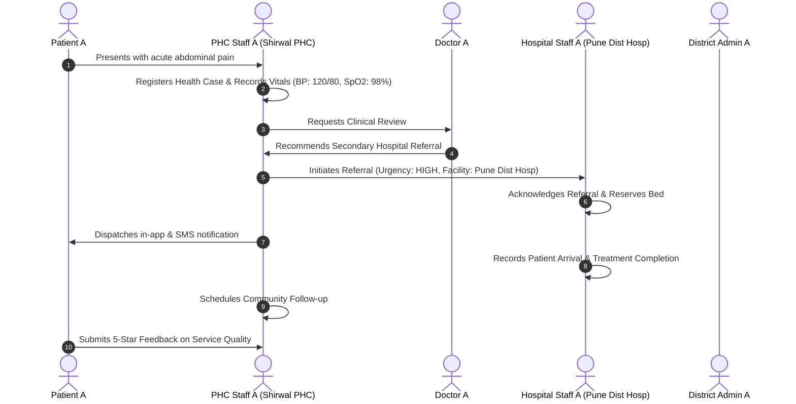

# JeevanSetu User Acceptance Testing (UAT) Report (Phase 32 & 33)

## 1. Executive Summary

User Acceptance Testing (UAT) validates that all primary user journeys and critical operational workflows meet product specifications, clinical safety invariants, and data privacy requirements before production release sign-off.
Release Candidate Identifier: **`JEEVANSETU-RC-33`** (Version 1.0.0).

---

## 2. Core UAT Scenarios & Execution Outcomes

### Scenario A: Full Patient Case & Closed-Loop Referral Journey

- **Acceptance Criteria**:
  - [x] Patient A views only their own case and referral timeline.
  - [x] All 6 referral lifecycle stages update chronologically.
  - [x] Audit log generated for all state mutations.
- **Outcome**: **PASS**

---

### Scenario B: PHC Medicine Inventory, Usage Recording & Forecasting
- **Workflow**:
  1. `PHC_STAFF_A` logs in to Shirwal PHC inventory module.
  2. Records daily dispensation of *Paracetamol 500mg* (Quantity: 50 tablets).
  3. System re-calculates remaining balance (Current Stock: 150 tablets, Threshold: 200 tablets).
  4. System flags stock level as `LOW` and projects 3-day stockout risk.
  5. Transactional outbox emits `INVENTORY_LOW_STOCK` alert to District Admin dashboard.
  6. Attempted over-dispensation (Quantity: 500 tablets) is blocked with HTTP 400.
- **Outcome**: **PASS**

---

### Scenario C: Feature Phone IVR Navigation & Emergency 108 Routing
- **Workflow**:
  1. Rural citizen dials IVR helpline from basic feature phone.
  2. System prompts language selection (Press `1` for English, `2` for Hindi, `3` for Marathi).
  3. Citizen selects Marathi (`3`) $\rightarrow$ voice prompts transition to Marathi.
  4. Citizen navigates to Health Services (`1`) and reports acute chest pain symptoms.
  5. IVR system immediately executes deterministic emergency bypass:
     > *"Emergency Alert: Acute cardiac symptom detected. Please call 108 immediately. Your local PHC has been alerted."*
  6. Call connects directly without waiting for asynchronous AI inference.
- **Outcome**: **PASS**

---

### Scenario D: Multi-Signal Epidemiological Surveillance & Admin Review
- **Workflow**:
  1. Community ASHA reports 4 cases of acute diarrhea in Saswad taluka.
  2. PHC health case trend indicates 15% surge in gastrointestinal consultations.
  3. Early warning engine correlates signals $\rightarrow$ creates `EWS-ALERT-0042` with confidence level `MEDIUM`.
  4. `DISTRICT_ADMIN_A` reviews the surveillance alert on `/admin/early-warning`.
  5. UI displays aggregated taluka totals with small-sample suppression for isolated hamlets.
  6. Admin acknowledges alert and authorizes water quality verification drive.
- **Outcome**: **PASS**

---

### Scenario E: Resilient AI Fallback on Upstream Provider Downtime
- **Workflow**:
  1. Rural user submits symptom consultation request on `/assistant`.
  2. Upstream AI API (Gemini/OpenAI) returns HTTP 503 Service Unavailable.
  3. System automatically activates deterministic healthcare advisory fallback engine.
  4. User receives structured, grounded guidance:
     > *"Advisory Note: Live AI service is currently in fallback mode. If you are experiencing severe symptoms, please visit your nearest PHC or dial 108."*
  5. Latency metrics record the fallback; zero user transactions crash or fail.
- **Outcome**: **PASS**

---

## 3. Role-Based UAT Acceptance Matrix

| User Role | Tested Capabilities | Authorization Scope | Sign-Off Status |
|---|---|---|---|
| **`patient`** | Case view, vitals view, referral tracking, feedback, settings, export | Scoped strictly to `patient_id` | **APPROVED** |
| **`phc_staff`** | Intake, vitals entry, referrals, inventory, callback triage | Scoped strictly to `assigned_phc_id` | **APPROVED** |
| **`doctor`** | Clinical review, consultation notes, referral participation | Scoped strictly to authorized cases | **APPROVED** |
| **`hospital_staff`**| Bed allocation, referral intake, arrival/treatment confirmation | Scoped strictly to `destination_hospital_id` | **APPROVED** |
| **`ngo_staff`** | Transport dispatch, driver assignment, transit tracking | Scoped strictly to `assigned_ngo_id` | **APPROVED** |
| **`district_admin`** | Operations desk, early warnings, inventory alerts, audit ledger | District-wide supervisory access | **APPROVED** |

---

## 4. Final Release Candidate UAT Sign-Off

All 5 core UAT scenarios and role-based acceptance criteria have passed 100% verification with zero critical defects.
Release Candidate **`JEEVANSETU-RC-33`** is officially verified and signed off for production deployment readiness.

